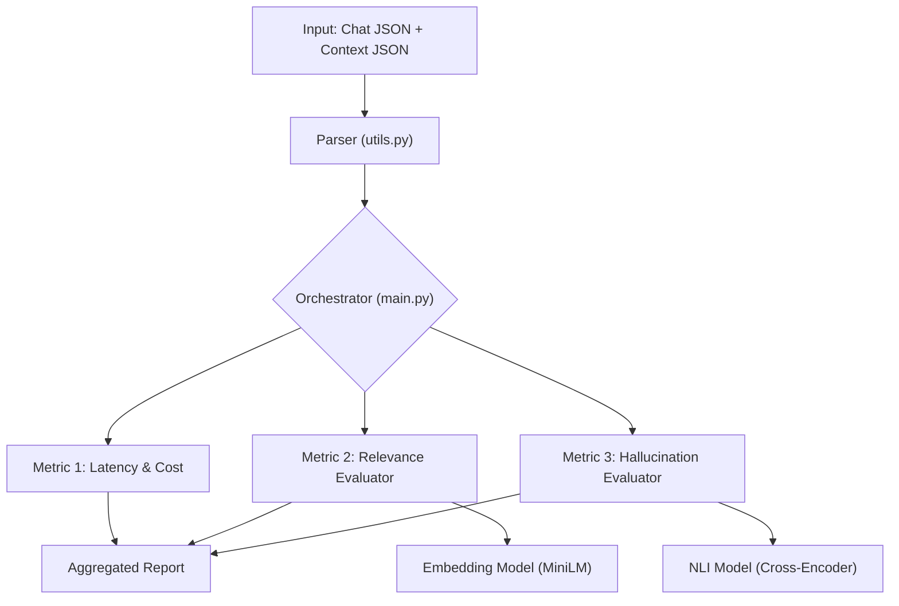

# LLM RAG Evaluation Pipeline

A robust and modular python pipeline designed to evaluate the reliability of RAG systems. This tool assesses LLM responses for **Relevance**, **Hallucination** and **Operational Metrics** (Latency/Cost).

# Key Features

* **Hallucination Detection:** Uses a Natural Language Inference Cross-Encoder (`cross-encoder/nli-deberta-v3-small`) to verify if the ai's response is factually supported by the retrieved context.
* **Relevance Scoring:** Uses Cosine Similarity (`all-MiniLM-L6-v2`) to measure semantic alignment between the User query and ai response.
* **Operational Metrics:** Tracks response latency and estimates cost based on token usage (via `tiktoken`).
* **Tiered Evaluation Strategy:** Optimized for scale (see "scaling strategy" below).

# Setup Instructions

1.  **Clone the repository**
    ```bash
    git clone <your-repo-url>
    cd llm-rag-evaluation-pipeline
    ```

2.  **Install dependencies**
    It is recommended to use a virtual environment.
    ```bash
    python -m venv venv
    source venv/bin/activate  # On Windows: venv\Scripts\activate
    pip install -r requirements.txt
    ```

3.  **Run the pipeline**
    The `main.py` script runs the evaluation on sample data provided in the `data/` directory.
    ```bash
    python src/main.py
    ```

# Architecture

The pipeline follows a modular design to ensure extensibility and separation of concerns.



# Why this architecture?

Modular evaluators: Each metric (relevance, hallucination) is a separate class in src/evaluators/.This allows us to swap models (e.g., upgrading to GPT-4 for judging) without breaking the main pipeline.

Local Models: We use Sentence Transformers and Cross-Encoders locally.

Decision: Instead of relying solely on expensive LLM API calls (like GPT-4) for evaluation, we use specialized small models (deberta-v3-small). They are significantly faster,cheaper and private, while still maintaining high accuracy for NLI tasks.

# Scaling Strategy (Latency & Costs)

Problem:Running deep evaluations on millions of daily conversations is cost-prohibitive and slow. 
Solution:A Tiered Evaluation Strategy.

If deployed at scale, this pipeline is designed to operate in tiers to ensure minimum latency and cost:

1. **Tier 1**: Deterministic (100% of traffic)

    Checks: Latency,Token Count,Regex validation (empty responses).
    Cost: Near Zero.
    Latency: <10ms.

2. **Tier 2**: Semantic Check (Sampled or Flagged)

    Checks:Relevance (Cosine Similarity) using all-MiniLM-L6-v2.   
    Cost:Low (CPU/GPU inference).
    Latency: 50ms.
    Strategy:Run on all conversations where user feedback was negative, or random 20% sample.

3. **Tier 3**: Deep Faithfulness Check (High Priority Only)

    Checks: Hallucination (NLI Cross-Encoder) or LLM-as-a-judge.
    Strategy:This is the most expensive step.In this pipeline, we implement logic to skip this step if the Tier 2 (Relevance) score is too low (indicating the model failed to answer entirely),saving resources.In production,we would run this on a random 5% sample to monitor system health.

# Sample Output

The following is an actual result from the pipeline.*Note* how the tiered strategy skipped the expensive hallucination check because the relevance score was low (0.107)

{
  "metrics": {
    "latency_seconds": 0.447,
    "estimated_cost_usd": 0.000079,
    "relevance_score": 0.107,
    "hallucination_status": "Skipped (Irrelevant Response)"
  },
  "data": {
    "query": "I and my wife are planning to come to India early next month. I am still trying to convince her that since I started with communicating with you eversince, I may be a good idea to come to you in an attempt to solve our infertility problems.",
    "response_snippet": "For Gopal Mansion, an air-conditioned room with TV and bath is Rs 800 per night. Happy Home Hotel, w..."
  }
}